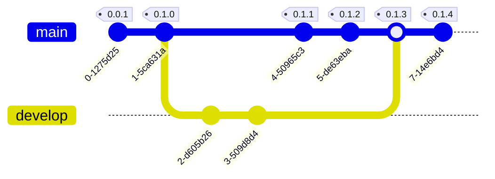
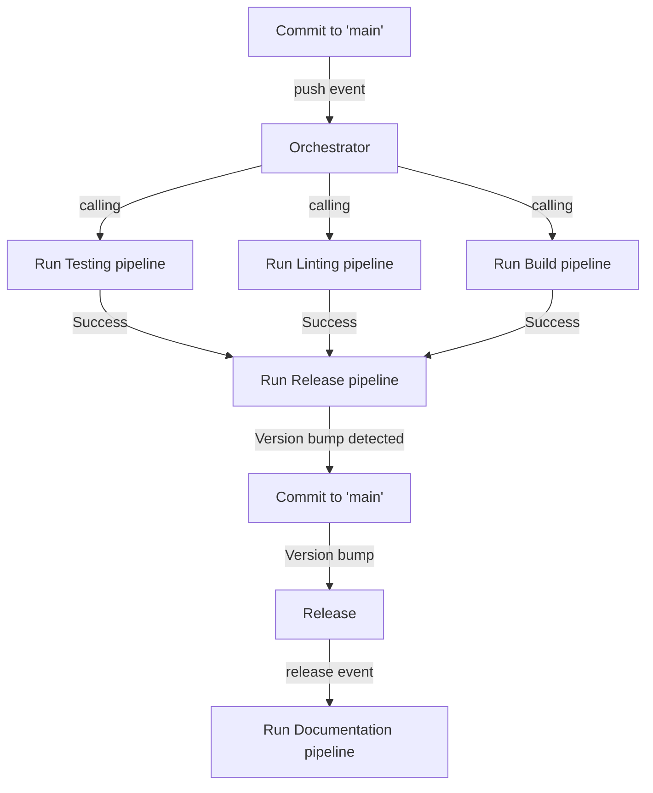

# :beginner: Setting up Python Projects :beginner:

This tutorial provides a step-by-step guide for creating a :snake: **Python project** using _best practices_.
It is aimed at developers who are starting or maintaining a Python package, or who want to create a Python project with
automatic features and follow modern best practices.
The tutorial is inspired by resources such
as [Hypermodern Python](https://medium.com/@cjolowicz/hypermodern-python-d44485d9d769)
and [Best Practices for a new Python project](https://mitelman.engineering/blog/python-best-practice/automating-python-best-practices-for-a-new-project/).
However, it should be noted that there are multiple ways to accomplish this task and this tutorial presents a personal,
potentially **opinionated**, approach with a **selection of tools**.
It is designed to be accessible for beginners while also covering some advanced topics.
In each subsequent section, tools will be automated and badges will be added to the project to track progress.

- [Setting up Python Projects: Part I](https://medium.com/@johschmidt42/setting-up-python-projects-part-i-408603868c08)
- [Setting up Python Projects: Part II](https://medium.com/@johschmidt42/setting-up-python-projects-part-ii-c4bd84b709d1)
- [Setting up Python Projects: Part III](https://medium.com/@johschmidt42/setting-up-python-projects-part-iii-56aafde8ae0b)
- [Setting up Python Projects: Part IV](https://medium.com/@johschmidt42/setting-up-python-projects-part-iv-82059eba4ca4)
- [Setting up Python Projects: Part V](https://johschmidt42.medium.com/setting-up-python-projects-part-v-206df3c1e3d3)
- Setting up Python Projects: Part VI

## :blue_book: Documentation

### [johschmidt42.github.io/python-project-johannes](https://johschmidt42.github.io/python-project-johannes/)

## :barber: Branching strategy (GitHub Flow)

The GitHub flow is a branching strategy for managing and collaborating on code projects using the Git version control
system and GitHub.
It involves a single main branch, called the default (`main`) branch, which is used for production code, and multiple
parallel branches for development work.

The flow typically works as follows:

1. Developers create a new branch for each new feature or bugfix they are working on.
2. They make changes to their local copy of the code and commit them to the branch.
3. They push the branch to GitHub and create a pull request (PR) to merge the changes back into the master branch.
4. Other team members review and test the changes in the PR.
5. Once the changes are approved, the PR is merged into the master branch.

The GitHub flow allows for multiple developers to work on different features simultaneously without conflicts, and also
enables easy code review and testing before changes are deployed to production.

## :hourglass: GitHub Actions Flow

GitHub Actions is a feature of GitHub that allows you to automate your software development workflows.
It allows you to create custom workflows, called "Actions," that are triggered by certain events on GitHub, such as when
a new pull request is opened or when code is pushed to a branch.

GitHub actions is not just CI/CD, but an entire automation platform.
The terminology is explained
here: [GitHub Actions terminology](https://dev.to/github/whats-the-difference-between-a-github-action-and-a-workflow-2gba)

The following flowchart illustrates the flow of workflows when committing to the default branch `main`.

Commits made to the main branch, typically through a Pull Request, will trigger a testing and linting pipeline to
identify bugs early.
If these pipelines are successful and a version bump is detected, a version bump commit will be created on the main
branch, updating the version strings in the repository.
Releasing an event will trigger the documentation pipeline, updating the documentation hosted on GitHub Pages.
