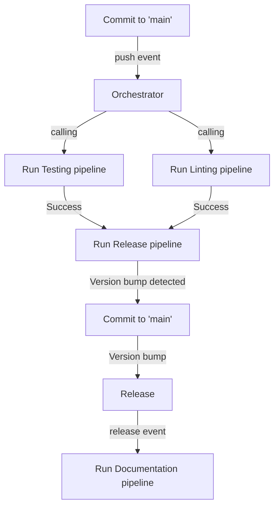

# python-project-johannes

## Branching strategy (GitHub Flow)

## GitHub Actions Flow

A commit to `main`, usually a **Pull Request** will run the `Testing`, the `Linting` pipeline to discover bugs early.
If these pipeline succeed and a version bump was detected it will create a version bump commit to `main` that changes the `version` strings in the repository.
A release event (published) will trigger the `Documentation` pipeline to update the documentation hosted with GitHub Pages. 
