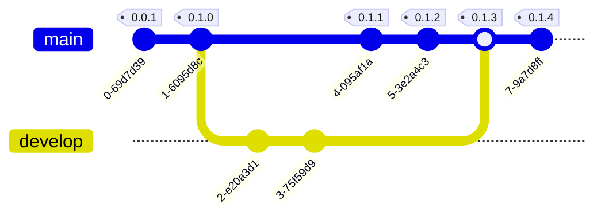

# python-project-johannes

## Branching strategy (GitHub Flow)

```mermaid

gitGraph
   commit tag: "0.0.1"
   commit tag: "0.1.0"
   branch develop
   checkout develop
   commit
   commit
   checkout main
   commit tag: "0.1.1"
   commit tag: "0.1.2"
   merge develop tag: "0.1.3"
   commit tag: "0.1.4"
```
